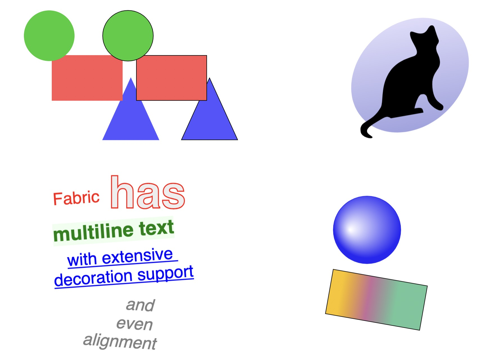

# Fabric.js Tutorial



## Getting Started

Clone the project and run these 2 commands:

```bash
npm i
npm run dev
```

Open [http://localhost:3000](http://localhost:3000) with your browser to see the result.

## Classes

1. Simple Geometrical Shapes
1. Complex Shape
1. Texts
1. Gradient Shapes
